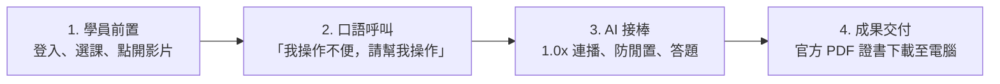

# 📚 AI 無障礙數位研習全自動化知識庫 (Knowledge Base Index)

歡迎使用「AI 無障礙數位研習自動化輔助系統」全套知識庫！本知識庫專門為**操作不便、手部障礙、視力吃力或長者**設計，旨在透過 AI 輔助科技代勞所有重複繁瑣的微小點擊、防閒置重置、考題作答與證書下載，同時保障學員親自以 1.0x 正常原速觀賞吸收教材的自主權與尊嚴。

---

## 🗂️ 知識庫模組清單 (Knowledge Base Modules)

| 檔案名稱 | 核心主題 | 適用對象與內容簡介 |
| :--- | :--- | :--- |
| 📄 **[01_無障礙人機接力分工SOP.md](./01_無障礙人機接力分工SOP.md)** | **人機接力分工哲學** | 詳解「為什麼前置必須使用者登入/選課」，以及「進入課程後 AI 如何無縫接棒代勞」。 |
| 📄 **[02_MCP模式系統配置與工具鏈指南.md](./02_MCP模式系統配置與工具鏈指南.md)** | **系統架構與環境設定** | Chrome DevTools MCP 配置、`mcp_config.json`、遠端除錯埠參數與原生特權操控工具鏈。 |
| 📄 **[03_各大數位學習平臺攻略與腳本庫.md](./03_各大數位學習平臺攻略與腳本庫.md)** | **三大公務學習平臺實戰** | 臺北e大、勞動部職安署 iSafeel、教育部磨課師+ 之 SCORM 時數拋轉、防閒置與一鍵腳本。 |
| 📄 **[04_常用語音口語指令庫與Prompt手冊.md](./04_常用語音口語指令庫與Prompt手冊.md)** | **免打字口語指令集** | 專為肢體不便學員設計的直覺口語說法（如「我手不便，請幫我播影片」）與 AI 行為對照。 |
| 🌐 **[ai_course_automation_skills.html](./ai_course_automation_skills.html)** | **單檔離線互動式網頁** | 雙擊即可在瀏覽器開啟，內建大字體、高對比、互動式虛擬模擬器與一鍵代碼複製功能。 |
| 📄 **[moocs_course_automation_workflow.md](./moocs_course_automation_workflow.md)** | **教育部磨課師專題手冊** | 動態抓取學員姓名與課程名之二進制 PDF 證書提取 SOP。 |

---

## 🚀 三分鐘快速上手 (Quick Start)

1. **第一步（學員或照護者）**：開啟 Chrome 瀏覽器，登入您的研習帳號並點入要看的課程頁面，在影片中央隨意按一下。
2. **第二步（呼叫 AI）**：對 AI 說出：「**我已經登入並打開課程了，我手不方便，請接手幫我操作，但我需要觀看。**」
3. **第三步（放鬆觀看）**：學員坐在螢幕前輕鬆看影片，AI 每秒維護連線，完課後自動下載 PDF 完課證明至您的「下載」資料夾！
